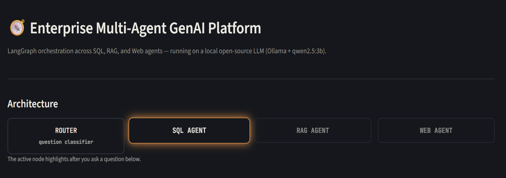
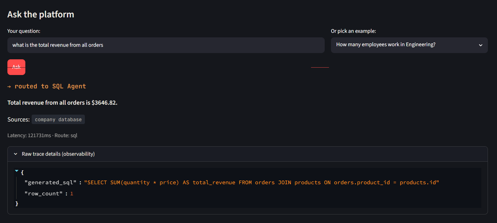
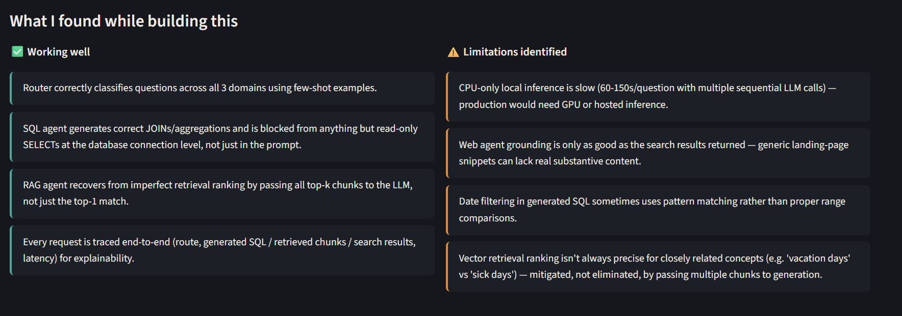

# Enterprise Multi-Agent GenAI Platform

A multi-agent AI platform that routes natural-language questions across three
specialized agents — SQL, RAG, and Web — using LangGraph for orchestration.
Runs entirely on local, open-source models (Ollama + qwen2.5:3b) with no paid
API keys required.

## Demo UI

A local Streamlit UI is included for showcasing the platform — the architecture
diagram, a live interactive demo, and a summary of findings/limitations
identified while building it.

```bash
streamlit run streamlit_app.py
```

**Architecture view + live routing:**

<!-- Screenshot: top of the app — architecture diagram with the active agent highlighted -->


**Live question demo:**

<!-- Screenshot: after asking a question — route, answer, sources, latency, trace details -->


**Findings — what works vs. limitations identified:**

<!-- Screenshot: the two-column findings/limitations section at the bottom -->


## Architecture

```
                    +-------+
         +--------->|  sql  |---------+
         |          +-------+         |
START -> router                       +--> END
         |          +-------+         |
         +--------->|  rag  |---------+
         |          +-------+         |
         |          +-------+         |
         +--------->|  web  |---------+
                    +-------+
```

- **Router**: an LLM classifies each question into `sql`, `rag`, or `web`.
- **SQL agent**: relevance check → schema-grounded SQL generation → read-only
  execution against SQLite → natural-language answer (never recalculates
  numbers — only narrates what SQL already computed).
- **RAG agent**: documents chunked (paragraph-aware, with overlap) → embedded
  with `sentence-transformers` (`all-MiniLM-L6-v2`) → stored/queried in
  ChromaDB → grounded answer synthesis with a distance-threshold cutoff to
  avoid answering when nothing relevant was retrieved.
- **Web agent**: live DuckDuckGo search → grounded answer synthesis.
- **Tracing**: every request logs question, route, agent-internal details
  (generated SQL / retrieved chunks+distances / search result count), answer,
  and latency to a local SQLite trace store — queryable via `/traces` and
  `/stats`.
- **API**: FastAPI exposes `/ask`, `/traces`, `/stats`, `/health`.

## Setup

```bash
python -m venv venv
venv\Scripts\activate          # Windows
pip install -r requirements.txt

ollama pull qwen2.5:3b

python app\seed_db.py          # seed the SQLite sample database
python -m app.vector_store     # build the RAG vector index
```

## Running

```bash
# CLI smoke test across all 3 agents
python -m app.graph_main

# Observability dashboard (terminal)
python -m app.tracing

# API server
uvicorn app.api:app --reload
# then visit http://127.0.0.1:8000/docs
```

## Key design decisions (and why)

- **Local model (Ollama, qwen2.5:3b) instead of a paid API** — zero cost,
  no vendor lock-in, and the LLM client is abstracted behind one function
  (`app/llm_client.py`) so swapping providers later is a one-line change.
- **Relevance pre-check before SQL generation** — combining "is this
  in-scope?" and "write the SQL" in a single prompt caused the model to
  echo stale output on out-of-scope questions instead of refusing. Splitting
  into two focused calls fixed it.
- **Schema + known-value grounding** — the LLM only knows table/column names
  and valid categorical values because we inject them into the prompt;
  without this it invented plausible-but-wrong filter values.
- **Defense in depth for SQL execution** — a statement-type check in code,
  *plus* a genuinely read-only SQLite connection at the engine level, so a
  bug in one layer doesn't compromise the database.
- **RAG passes all k retrieved chunks to generation**, not just the top-1 —
  vector similarity ranking isn't always perfectly precise (a "vacation
  days" query once ranked a sick-leave chunk above the correct PTO chunk);
  giving the LLM the full retrieved set let it reason past an imperfect
  ranking.
- **Distance-threshold cutoff for RAG** — refuses to answer (in code, not
  just via a prompt instruction) when nothing genuinely relevant was
  retrieved, tuned empirically from observed distance values.
- **Full tracing on every request** — supports the "explainable AI" goal:
  any answer's full decision trail (route chosen, SQL/chunks/search results
  used) is persisted and queryable after the fact.

## Known limitations

- CPU-only local inference is slow (~60-150s/question with multiple
  sequential LLM calls) — a production deployment would use GPU infra or a
  hosted API.
- Web agent grounding is only as good as DuckDuckGo's unofficial search
  results; category/landing-page snippets can lack real content.
- Date filtering in generated SQL sometimes uses `LIKE '%year%'` patterns
  rather than proper range comparisons — works for this dataset, not fully
  general.
